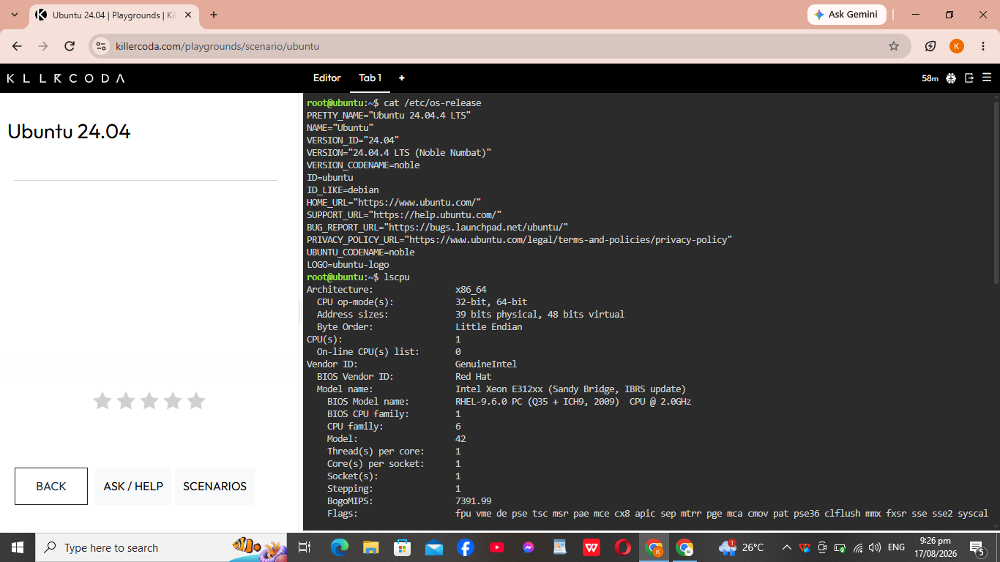

# Checkpoint 7 – Linux Investigation

## Linux Server Information

The Linux server was investigated using the KillerCoda Ubuntu 24.04 Playground.

### Operating System

The server is running Ubuntu 24.04.

### CPU Information

The CPU information was collected using the `lscpu` command.

### Memory

The memory information was collected using the `free -h` command.

### Disk Space

The disk space information was collected using the `df -h` command.

## Cloud Migration

If this Linux server were migrated to the cloud, it could be hosted by the following services:

| Cloud Provider | Service | Purpose |
|---|---|---|
| AWS | Amazon EC2 | Provides virtual servers that can run Linux operating systems. |
| Microsoft Azure | Azure Virtual Machines | Provides virtual machines that can run Ubuntu and other Linux distributions. |
| Google Cloud Platform | Google Compute Engine | Provides scalable virtual machines that can run Linux operating systems. |

All three services can host a Linux server such as Ubuntu 24.04. The appropriate service can be selected based on the organization's requirements, including computing resources, scalability, networking, storage, and cost.

## Terminal Screenshot

The following screenshot shows the Linux commands and terminal output collected from the KillerCoda Ubuntu 24.04 environment.

